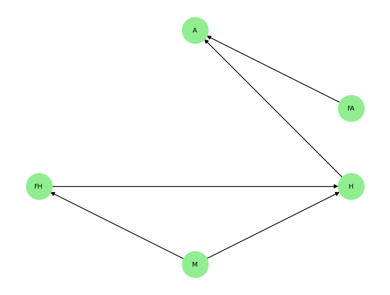

# Probabilistic Inference and Bayesian Networks
```

The ipynb Notebook implements finding conditional probabilities based on the given dictionary.

- [Probabilistic Inference and Bayesian Networks](#probabilistic-inference-and-bayesian-networks)
  - [Requirements](#requirements)
  - [Joint Probability Distribution](#joint-probability-distribution)
  - [Input](#input)
  - [How To Run](#how-to-run)
  - [Functions Explanation](#functions-explanation)
    - [1. separateAnds()](#1-separateands)
    - [2. getEventEvidence()](#2-geteventevidence)
    - [3. calculate\_conditional\_probability()](#3-calculate_conditional_probability)
  - [Code Explanation](#code-explanation)
  - [Bonus](#bonus)
    - [Output](#output)


## Requirements

1. Python
2. Jupyter

```bash
pip install notebook #For jupyter notebook
```

## Joint Probability Distribution

```py
joint_distribution = {
    ('high', 'A', 'F_H'): 0.175,
    ('high', '~A', 'F_H'): 0.075,
    ('normal', 'A', 'F_H'): 0.05,
    ('normal', '~A', 'F_H'): 0.2,
    ('high', 'A', '~F_H'): 0.2375,
    ('high', '~A', '~F_H'): 0.0125,
    ('normal', 'A', '~F_H'): 0.0125,
    ('normal', '~A', '~F_H'): 0.2375
}

```

## Input

Input can be given in the format:

```text
P(A|F_H)
P(A|~F_H^high)
P(F_H|~A)
P(A|F_H^high)
```

## How To Run

1. Open the terminal in the folder where the ipynb is.
2. Open the notebook as a jupyter notebook.

   ```bash
   jupyter notebook 
   ```

3. Run all the cells including the main cell of the notebook.
4. Input the desired conditional probability (Use the exaples given above)

## Functions Explanation

### 1. separateAnds()

```plaintext
Seperates A^B to 'A' and 'B'.
```

### 2. getEventEvidence()

```plaintext
Uses regex and extracts the 'A' and 'B' from P(A|B).
```

### 3. calculate_conditional_probability()

```plaintext
Takes in the joint_distribution, event and evidence to calculate the conditional probability.
```

## Code Explanation

In gist, we use the Bayes Theorem formula: $ P(A | B) = \frac{P( A ^ B )}{P(B)} $. The numerator and denominator are calculated and divided.

1. First we get input from the user.

2. Regex is used to get the text inside the P(..) part.

3. The extracted text is split along "|".

4. After that, if there are any ^ in events or evidence, we split it along "^" and create a list of the split items.

5. These items are then checked if they match any of the joint distribution.

6. If found, the joint probability value is added.

7. Finally the numerator is divided by the denominator. 

## Bonus

For the bonus, the following libraries were used:

```py
import networkx as nx
import matplotlib.pyplot as plt
```

The networkx has a built in Directed Graph method where all we need to do is add nodes and edges.

```py
G.add_nodes_from(["A", "FA", "FH", "H", "M"])
G.add_edges_from([("M", "FH"), ("M", "H"), ("FH", "H"), ("H", "A"), ("FA", "A")])
```

matplotlib was used to show the plot.

### Output

